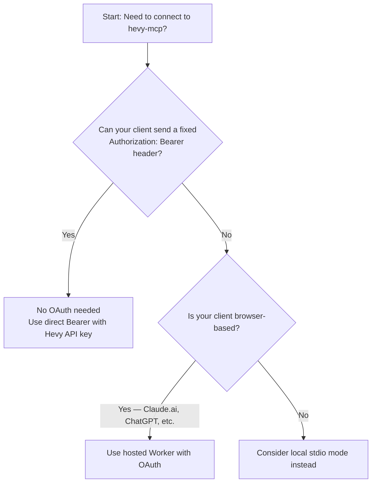
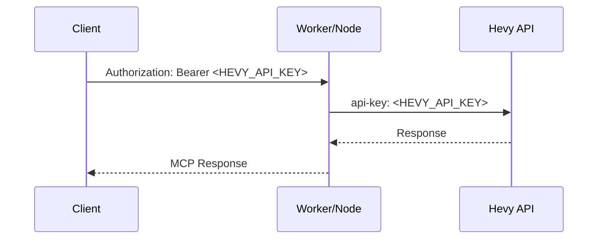
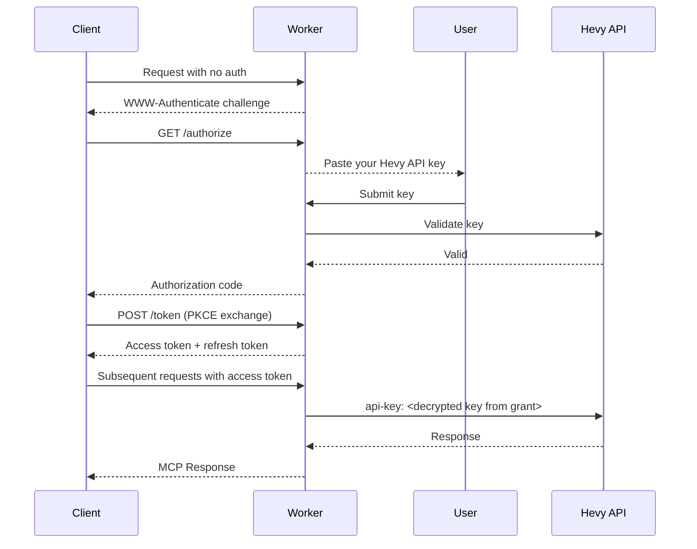

# Deployment Modes

`hevy-mcp` supports four distinct deployment modes — Hosted Cloudflare Worker, Local Node stdio, Local Node HTTP, and Remote Node HTTP — each suited to different infrastructure requirements and client capabilities. All four modes expose the same [22 MCP tools](https://github.com/chrisdoc/hevy-mcp/blob/47eac6bd864bbfc1d66bbd48881df895e1a4214e/README.md#L370-L403) and follow the same tool contract; only the adapter layer and transport mechanism differ [[1]](https://app.dosu.dev/documents/26a6ed7f-f9b9-4bce-bc57-e7b1c60b6278). Choose the mode that matches how your MCP client connects and whether you need OAuth support, a persistent session, or zero local dependencies.

## Side-by-Side Comparison Table

| Aspect              | Hosted Cloudflare Worker                                                                              | Local Node stdio                                       | Local Node HTTP                                                                 | Remote Node HTTP                                                         |
| ------------------- | ----------------------------------------------------------------------------------------------------- | ------------------------------------------------------ | ------------------------------------------------------------------------------- | ------------------------------------------------------------------------ |
| **Command / Setup** | Public endpoint at `https://mcp.hevy-mcp.dev/mcp`; self-host via `npx wrangler deploy --x-new-config` | `npx hevy-mcp` (spawned by MCP client)                 | `npx hevy-mcp --transport http --host 127.0.0.1 --port 3000`                    | Container platform (Railway, Render, Fly) with `HEVY_MCP_OAUTH=1`        |
| **Transport**       | Streamable HTTP                                                                                       | stdio (stdin/stdout)                                   | Streamable HTTP                                                                 | Streamable HTTP                                                          |
| **Endpoint**        | `https://mcp.hevy-mcp.dev/mcp` (or custom domain)                                                     | N/A — piped                                            | `http://127.0.0.1:3000/mcp`                                                     | `https://<your-domain>/mcp`                                              |
| **Statefulness**    | Stateless — fresh MCP server and Hevy client per request                                              | Stateful — persistent session for process lifetime     | Stateful — persistent client sessions                                           | Stateful — one session per authorized client                             |
| **Authentication**  | Bearer header with Hevy API key OR OAuth 2.1                                                          | `HEVY_API_KEY` env var on child process                | `HEVY_API_KEY` env var + optional `HEVY_MCP_HTTP_BEARER_TOKEN` for non-loopback | OAuth 2.1 per user, or a direct Hevy API key bearer                      |
| **OAuth Support**   | Yes (with `OAUTH_KV` binding)                                                                         | No                                                     | No                                                                              | Yes (`HEVY_MCP_OAUTH=1`)                                                 |
| **Cache behavior**  | Fresh cache per request — no cross-key sharing                                                        | Server-scoped in-memory cache (5 min TTL)              | Server-scoped in-memory cache (5 min TTL)                                       | Server-scoped in-memory cache (5 min TTL)                                |
| **Telemetry**       | No Node telemetry                                                                                     | Enabled by default (`HEVY_MCP_TELEMETRY=0` to disable) | Enabled by default                                                              | Enabled by default                                                       |
| **Best for**        | Claude.ai, remote clients, shared/hosted access                                                       | Claude Desktop, Cursor, Codex, local AI tools          | Local network testing, Docker, non-loopback access                              | Self-hosted Claude connectors on your own infrastructure                 |
| **Security note**   | Origin allowlist enforced for browser requests                                                        | Key in child process env only                          | Non-loopback binds require separate `HEVY_MCP_HTTP_BEARER_TOKEN`                | Origin allowlist enforced; grants sealed per token; run a single replica |

## Hosted Cloudflare Worker Mode

The production Hevy MCP server runs as a stateless Cloudflare Worker at `https://mcp.hevy-mcp.dev/mcp` [[2]](https://github.com/chrisdoc/hevy-mcp/blob/47eac6bd864bbfc1d66bbd48881df895e1a4214e/README.md#L420-L424). This mode requires no installation—no Node.js, Bun, or Docker—and exposes the same 22 tools as the npm package and Docker image [[3]](https://github.com/chrisdoc/hevy-mcp/blob/47eac6bd864bbfc1d66bbd48881df895e1a4214e/README.md#L426-L428).

### How It Works

Each request gets a fresh MCP server instance, Streamable HTTP transport, Hevy client, and exercise-template cache [[4]](https://github.com/chrisdoc/hevy-mcp/blob/47eac6bd864bbfc1d66bbd48881df895e1a4214e/README.md#L348-L349) [[5]](https://github.com/chrisdoc/hevy-mcp/blob/47eac6bd864bbfc1d66bbd48881df895e1a4214e/CONTRIBUTING.md#L282-L293). The Worker validates the supplied Hevy API key with Hevy on each request, does not store it, and forwards it to Hevy only as the required `api-key` header [[6]](https://github.com/chrisdoc/hevy-mcp/blob/47eac6bd864bbfc1d66bbd48881df895e1a4214e/README.md#L446-L448). There is no shared user session or persisted key [[7]](https://github.com/chrisdoc/hevy-mcp/blob/47eac6bd864bbfc1d66bbd48881df895e1a4214e/README.md#L349-L350).

The Worker uses stateless **Streamable HTTP** at `POST /mcp` [[8]](https://github.com/chrisdoc/hevy-mcp/blob/47eac6bd864bbfc1d66bbd48881df895e1a4214e/README.md#L430).

### Direct Bearer Authentication

Clients send `Authorization: Bearer <HEVY_API_KEY>` on every request [[9]](https://github.com/chrisdoc/hevy-mcp/blob/47eac6bd864bbfc1d66bbd48881df895e1a4214e/README.md#L431-L448):

```json
{
	"mcpServers": {
		"hevy": {
			"url": "https://mcp.hevy-mcp.dev/mcp",
			"headers": {
				"Authorization": "Bearer your-hevy-api-key"
			}
		}
	}
}
```

> [!IMPORTANT]
> Treat the bearer value like a password. The Worker validates it with Hevy for each request, does not store it, and forwards it to Hevy only as the required `api-key` header [[6]](https://github.com/chrisdoc/hevy-mcp/blob/47eac6bd864bbfc1d66bbd48881df895e1a4214e/README.md#L446-L448).

**Codex hosted example**:

```bash
export HEVY_API_KEY=your-hevy-api-key
codex mcp add hevy \
  --url https://mcp.hevy-mcp.dev/mcp \
  --bearer-token-env-var HEVY_API_KEY
```

Codex stores the environment variable name, not the key itself, in its MCP configuration [[10]](https://github.com/chrisdoc/hevy-mcp/blob/47eac6bd864bbfc1d66bbd48881df895e1a4214e/README.md#L130-L132).

### OAuth 2.1

The hosted production Worker exposes a full OAuth 2.1 layer for clients that cannot send a fixed `Authorization` header, such as Claude.ai custom connectors [[11]](https://github.com/chrisdoc/hevy-mcp/blob/47eac6bd864bbfc1d66bbd48881df895e1a4214e/README.md#L450-L455).

The OAuth layer is opt-in: it requires an `OAUTH_KV` KV namespace binding on the Worker [[12]](https://github.com/chrisdoc/hevy-mcp/blob/47eac6bd864bbfc1d66bbd48881df895e1a4214e/CONTRIBUTING.md#L386-L396). The hosted production Worker is deployed with this binding; self-hosted Workers can opt in by following the `OAUTH_KV` setup in [CONTRIBUTING.md](https://github.com/chrisdoc/hevy-mcp/blob/main/CONTRIBUTING.md#optional-oauth-layer-for-remote-mcp-clients).

**OAuth endpoints and discovery** [[13]](https://github.com/chrisdoc/hevy-mcp/blob/47eac6bd864bbfc1d66bbd48881df895e1a4214e/CONTRIBUTING.md#L402-L410):

- RFC 8414 / RFC 9728 discovery metadata at `/.well-known/oauth-authorization-server` and `/.well-known/oauth-protected-resource`
- Dynamic client registration at `/register` (RFC 7591)
- PKCE token exchange at `/token` (authorization code + PKCE and refresh-token grants)
  - PKCE with S256 only; plain code challenges are disabled [[14]](https://github.com/chrisdoc/hevy-mcp/blob/47eac6bd864bbfc1d66bbd48881df895e1a4214e/packages/worker/src/worker-oauth.ts#L537)
- `/authorize` page where the user pastes their Hevy API key once; the key is validated with Hevy and stored encrypted inside the OAuth grant [[15]](https://github.com/chrisdoc/hevy-mcp/blob/47eac6bd864bbfc1d66bbd48881df895e1a4214e/CONTRIBUTING.md#L409-L410)

**Token lifetimes** [[16]](https://github.com/chrisdoc/hevy-mcp/blob/47eac6bd864bbfc1d66bbd48881df895e1a4214e/README.md#L468-L470):

- Access tokens: **7 days**
- Refresh tokens: **30 days**

These durations reduce KV writes from frequent hourly refreshes while preserving automatic refresh for supported clients [[16]](https://github.com/chrisdoc/hevy-mcp/blob/47eac6bd864bbfc1d66bbd48881df895e1a4214e/README.md#L468-L470).

> [!NOTE]
> OAuth is purely additive—direct `Authorization: Bearer <hevy-api-key>` requests keep working unchanged [[17]](https://github.com/chrisdoc/hevy-mcp/blob/47eac6bd864bbfc1d66bbd48881df895e1a4214e/README.md#L463-L465). The Worker routes bearer values matching the OAuth access-token shape (`userId:grantId:secret`) to the OAuth layer; Hevy API keys never contain a colon, so they continue using the direct Bearer path [[18]](https://github.com/chrisdoc/hevy-mcp/blob/47eac6bd864bbfc1d66bbd48881df895e1a4214e/packages/worker/src/worker-oauth.ts#L67-L74).

> [!WARNING]
> Rotating your Hevy API key invalidates every OAuth grant created with it [[19]](https://github.com/chrisdoc/hevy-mcp/blob/47eac6bd864bbfc1d66bbd48881df895e1a4214e/README.md#L465-L466).

To use OAuth with Claude.ai, add the Worker URL ending in `/mcp` as a Claude.ai custom connector and complete the authorization flow in the browser [[20]](https://github.com/chrisdoc/hevy-mcp/blob/47eac6bd864bbfc1d66bbd48881df895e1a4214e/README.md#L462-L463).

### Origin Allowlist

Browser requests must send an exact origin from the Worker's default allowlist [[21]](https://github.com/chrisdoc/hevy-mcp/blob/47eac6bd864bbfc1d66bbd48881df895e1a4214e/CONTRIBUTING.md#L356-L367):

- `https://claude.ai`
- `https://www.claude.ai`
- `https://claude.com`
- `https://www.claude.com`
- `https://chatgpt.com`
- `https://chat.openai.com`
- `https://vscode.dev`
- `https://github.dev`

Self-hosted deployments can replace this list with the optional comma-separated Worker variable `MCP_ALLOWED_ORIGINS` [[22]](https://github.com/chrisdoc/hevy-mcp/blob/47eac6bd864bbfc1d66bbd48881df895e1a4214e/CONTRIBUTING.md#L369-L374):

```text
MCP_ALLOWED_ORIGINS=https://app.example.com,https://admin.example.com
```

Wildcards are unsupported; browser requests with an unmatched `Origin` receive `403` [[23]](https://github.com/chrisdoc/hevy-mcp/blob/47eac6bd864bbfc1d66bbd48881df895e1a4214e/CONTRIBUTING.md#L382-L384). Non-browser requests without an `Origin` header remain accepted [[24]](https://github.com/chrisdoc/hevy-mcp/blob/47eac6bd864bbfc1d66bbd48881df895e1a4214e/CONTRIBUTING.md#L383-L384).

### Self-Hosting

A clean clone can deploy the portable TypeScript Wrangler configuration with [[25]](https://github.com/chrisdoc/hevy-mcp/blob/47eac6bd864bbfc1d66bbd48881df895e1a4214e/README.md#L479-L480) [[26]](https://github.com/chrisdoc/hevy-mcp/blob/47eac6bd864bbfc1d66bbd48881df895e1a4214e/CONTRIBUTING.md#L298-L312):

```bash
npx wrangler deploy --x-new-config
```

This command deploys to a `workers.dev` URL [[27]](https://github.com/chrisdoc/hevy-mcp/blob/47eac6bd864bbfc1d66bbd48881df895e1a4214e/README.md#L480-L481).

**OAuth requires your own `OAUTH_KV` namespace** [[28]](https://github.com/chrisdoc/hevy-mcp/blob/47eac6bd864bbfc1d66bbd48881df895e1a4214e/README.md#L481):

```bash
npx wrangler kv namespace create OAUTH_KV
```

Bind the namespace ID as `OAUTH_KV` in your Wrangler environment [[29]](https://github.com/chrisdoc/hevy-mcp/blob/47eac6bd864bbfc1d66bbd48881df895e1a4214e/CONTRIBUTING.md#L391-L400).

Custom domains, routes, and observability destinations are optional account-owned settings [[30]](https://github.com/chrisdoc/hevy-mcp/blob/47eac6bd864bbfc1d66bbd48881df895e1a4214e/README.md#L481-L482). See [CONTRIBUTING.md](https://github.com/chrisdoc/hevy-mcp/blob/main/CONTRIBUTING.md#cloudflare-worker-development) [[31]](https://github.com/chrisdoc/hevy-mcp/blob/47eac6bd864bbfc1d66bbd48881df895e1a4214e/CONTRIBUTING.md#L282-L355) for full setup details and the distinction between self-hosting and the maintainer-only named environments.

> [!NOTE]
> The Worker does **not** expose a standalone `GET` event stream [[32]](https://github.com/chrisdoc/hevy-mcp/blob/47eac6bd864bbfc1d66bbd48881df895e1a4214e/README.md#L472-L475). Clients that need the server-initiated SSE stream must use one of the Node modes instead, which serve it on `GET /mcp`.
>
> Note that Streamable HTTP already _is_ the SSE-based MCP transport: responses
> are delivered as `text/event-stream` when the exchange streams. The separate
> legacy "HTTP+SSE" transport (`GET /sse` plus `POST /messages`) was deprecated
> in the MCP specification and removed from the v2 SDK, so no adapter offers it.

## Local Node stdio Mode (Default)

The default deployment mode requires no flags — just `npx hevy-mcp` [[33]](https://github.com/chrisdoc/hevy-mcp/blob/47eac6bd864bbfc1d66bbd48881df895e1a4214e/README.md#L251-L261). Your MCP client spawns hevy-mcp as a child process and communicates over stdin and stdout using the MCP JSON-RPC protocol. This mode is stateful: the server maintains a persistent session for the lifetime of the process [[34]](https://github.com/chrisdoc/hevy-mcp/blob/47eac6bd864bbfc1d66bbd48881df895e1a4214e/CONTRIBUTING.md#L55-L75).

`npx` requires Node.js 20 or newer [[35]](https://github.com/chrisdoc/hevy-mcp/blob/47eac6bd864bbfc1d66bbd48881df895e1a4214e/README.md#L260-L261).

### Authentication

The `HEVY_API_KEY` is injected through the child process environment [[36]](https://github.com/chrisdoc/hevy-mcp/blob/47eac6bd864bbfc1d66bbd48881df895e1a4214e/README.md#L492-L494). The key never appears in a network header from the client side — the MCP client passes it to the spawned hevy-mcp process, which uses it internally when calling the Hevy API.

### Client Configuration

Client configuration varies by platform. Each example shows the config file path and the JSON block or command needed to connect to hevy-mcp in stdio mode.

#### Claude Desktop

**macOS:** `~/Library/Application Support/Claude/claude_desktop_config.json`  
**Windows:** `%APPDATA%\Claude\claude_desktop_config.json`

```json
{
	"mcpServers": {
		"hevy": {
			"command": "npx",
			"args": ["-y", "hevy-mcp"],
			"env": {
				"HEVY_API_KEY": "your-hevy-api-key"
			}
		}
	}
}
```

[[37]](https://github.com/chrisdoc/hevy-mcp/blob/47eac6bd864bbfc1d66bbd48881df895e1a4214e/README.md#L172-L188) [[38]](https://github.com/chrisdoc/hevy-mcp/blob/47eac6bd864bbfc1d66bbd48881df895e1a4214e/README.md#L241-L249)

#### Cursor

**Location:** `~/.cursor/mcp.json`

Use the same JSON block as Claude Desktop above.

#### Codex

```bash
codex mcp add hevy \
  --env HEVY_API_KEY=your-hevy-api-key \
  -- npx -y hevy-mcp
```

[[39]](https://github.com/chrisdoc/hevy-mcp/blob/47eac6bd864bbfc1d66bbd48881df895e1a4214e/README.md#L164-L170)

#### Docker (stdio mode)

Docker stdio mode requires the `-i` flag to keep stdin open:

```bash
export HEVY_API_KEY=your-hevy-api-key
docker run -i --rm -e HEVY_API_KEY ghcr.io/chrisdoc/hevy-mcp:latest
```

For MCP client configuration with Docker, use an env-file approach:

```json
{
	"mcpServers": {
		"hevy": {
			"command": "docker",
			"args": [
				"run",
				"-i",
				"--rm",
				"--env-file",
				"/absolute/path/to/hevy-mcp.env",
				"ghcr.io/chrisdoc/hevy-mcp:latest"
			]
		}
	}
}
```

[[40]](https://github.com/chrisdoc/hevy-mcp/blob/47eac6bd864bbfc1d66bbd48881df895e1a4214e/README.md#L284-L319)

> [!TIP]
> **bunx alternative** (requires [Bun](https://bun.sh/)):
>
> ```json
> {
> 	"mcpServers": {
> 		"hevy": {
> 			"command": "bunx",
> 			"args": ["hevy-mcp@latest"],
> 			"env": {
> 				"HEVY_API_KEY": "your-hevy-api-key"
> 			}
> 		}
> 	}
> }
> ```

### Debug and Telemetry

Set `HEVY_MCP_DEBUG=1` (exactly `1`) for privacy-bounded diagnostics [[41]](https://github.com/chrisdoc/hevy-mcp/blob/47eac6bd864bbfc1d66bbd48881df895e1a4214e/README.md#L496). Debug output is written to stderr; stdout is reserved exclusively for MCP JSON-RPC messages [[41]](https://github.com/chrisdoc/hevy-mcp/blob/47eac6bd864bbfc1d66bbd48881df895e1a4214e/README.md#L496).

> [!NOTE]
> stdout remains reserved for MCP JSON-RPC. All debug output goes to stderr to avoid interfering with the protocol.

Telemetry is enabled by default. Set `HEVY_MCP_TELEMETRY=0` (exactly `0`) before startup or import to disable all project telemetry, including Sentry error reporting and OTLP traces/metrics [[42]](https://github.com/chrisdoc/hevy-mcp/blob/47eac6bd864bbfc1d66bbd48881df895e1a4214e/README.md#L498).

The update check cache is stored at `$XDG_CACHE_HOME/hevy-mcp/update-check.json`, defaulting to `~/.cache/hevy-mcp/update-check.json` when `XDG_CACHE_HOME` is unset [[43]](https://github.com/chrisdoc/hevy-mcp/blob/47eac6bd864bbfc1d66bbd48881df895e1a4214e/README.md#L499).

## Local Node HTTP Mode

The local Node executable uses stdio by default. Opt into local HTTP mode with the `--transport http --host <host> --port <port>` flags [[44]](https://github.com/chrisdoc/hevy-mcp/blob/47eac6bd864bbfc1d66bbd48881df895e1a4214e/README.md#L505-L506). This mode is distinct from the stateless Cloudflare Worker: the Node server owns stateful client sessions and shares an in-memory cache across concurrent sessions within the same running process [[45]](https://github.com/chrisdoc/hevy-mcp/blob/47eac6bd864bbfc1d66bbd48881df895e1a4214e/README.md#L521-L523).

### Quickstart

```bash
HEVY_API_KEY=your-hevy-api-key npx hevy-mcp --transport http --host 127.0.0.1 --port 3000
```

The MCP endpoint is `http://127.0.0.1:3000/mcp` [[46]](https://github.com/chrisdoc/hevy-mcp/blob/47eac6bd864bbfc1d66bbd48881df895e1a4214e/README.md#L508-L512).

### Security

> [!IMPORTANT]
> Non-loopback binds require the separate `HEVY_MCP_HTTP_BEARER_TOKEN` environment variable [[47]](https://github.com/chrisdoc/hevy-mcp/blob/47eac6bd864bbfc1d66bbd48881df895e1a4214e/README.md#L512-L513), unless OAuth is enabled with `HEVY_MCP_OAUTH=1`, which authenticates every request against a per-user grant instead. This token protects the HTTP endpoint itself.

> [!WARNING]
> Never use the Hevy API key as the HTTP bearer token [[48]](https://github.com/chrisdoc/hevy-mcp/blob/47eac6bd864bbfc1d66bbd48881df895e1a4214e/README.md#L497). The `HEVY_MCP_HTTP_BEARER_TOKEN` is a separate security boundary for the HTTP transport layer, while `HEVY_API_KEY` authenticates with the Hevy service.

Loopback-only binds (127.0.0.1 or localhost) do not require `HEVY_MCP_HTTP_BEARER_TOKEN` [[49]](https://github.com/chrisdoc/hevy-mcp/blob/47eac6bd864bbfc1d66bbd48881df895e1a4214e/README.md#L496-L497).

### Docker

Docker deployments must publish the port explicitly with `-p` and use `--host 0.0.0.0` to bind to all interfaces [[50]](https://github.com/chrisdoc/hevy-mcp/blob/47eac6bd864bbfc1d66bbd48881df895e1a4214e/README.md#L514-L519):

```bash
docker run --rm -p 3000:3000 -e HEVY_API_KEY -e HEVY_MCP_HTTP_BEARER_TOKEN \
  ghcr.io/chrisdoc/hevy-mcp:latest --transport http --host 0.0.0.0 --port 3000
```

Because `0.0.0.0` is a non-loopback address, `HEVY_MCP_HTTP_BEARER_TOKEN` is required [[47]](https://github.com/chrisdoc/hevy-mcp/blob/47eac6bd864bbfc1d66bbd48881df895e1a4214e/README.md#L512-L513).

### Cache Behavior

The server maintains a server-scoped in-memory cache for `search-exercise-templates` and `hevy://exercise-templates` [[51]](https://github.com/chrisdoc/hevy-mcp/blob/47eac6bd864bbfc1d66bbd48881df895e1a4214e/README.md#L527-L534):

- Entries live for five minutes; the cache holds at most one catalog.
- Concurrent catalog requests share an in-flight fetch when possible.
- `search-exercise-templates` accepts `refresh: true` to invalidate the cache.
- Paginated `get-exercise-templates` calls always fetch their requested page.
- Unlike the hosted Worker, which gets a fresh cache per request, the Node server shares the cache across all sessions in the same running process [[52]](https://github.com/chrisdoc/hevy-mcp/blob/47eac6bd864bbfc1d66bbd48881df895e1a4214e/README.md#L534).

## Remote Node HTTP Mode

The Node HTTP adapter can also be deployed as a public remote MCP server on a
container platform such as Railway, Render, or Fly.io. It is the self-hosted
alternative to the Cloudflare Worker for people who want a Node runtime, a
stateful session model, and their own infrastructure.

Enable it with `HEVY_MCP_OAUTH=1`:

```bash
HEVY_MCP_OAUTH=1 \
HEVY_MCP_PUBLIC_URL=https://your-app.example.com \
  npx hevy-mcp --transport http --host 0.0.0.0 --port 8080
```

This changes three things relative to Local Node HTTP mode:

- **Authentication** — the server serves an OAuth 2.1 authorization server
  (RFC 8414 and RFC 9728 discovery, RFC 7591 dynamic client registration,
  authorization code with mandatory S256 PKCE, rotating refresh tokens). Each
  user supplies their own Hevy API key on the `/authorize` consent page, so the
  server itself needs no `HEVY_API_KEY`.
- **Key custody** — the API key in each grant is sealed against the secret
  inside the client's own token. The stored grant is not enough to reach a Hevy
  account. Grants are in memory unless `HEVY_MCP_OAUTH_STORE_PATH` is set.
- **Browser access** — a CORS allowlist matching the Worker's is applied, so
  Claude and ChatGPT web clients can complete requests.

Sessions are bound to the identity that created them: a session id obtained by
one grant cannot be driven by another.

Because the grant store is per process, run a single replica. See
[railway-deployment.md](railway-deployment.md) for a full walkthrough.

## Do I Need OAuth? Decision Tree

Use this flowchart to decide whether you need OAuth 2.1 or can use a simpler direct bearer configuration.



> [!NOTE]
> The OAuth layer is **purely additive**. If you can send a fixed `Authorization: Bearer <HEVY_API_KEY>` header, you never need OAuth — even on the hosted Worker. OAuth exists only for browser-based clients (like Claude.ai custom connectors) that cannot attach fixed headers to outbound requests [[53]](https://github.com/chrisdoc/hevy-mcp/blob/47eac6bd864bbfc1d66bbd48881df895e1a4214e/README.md#L462-L475).

## Authentication Flow Diagrams

### Direct Bearer Auth

The simplest authentication path — works with all three deployment modes [[54]](https://github.com/chrisdoc/hevy-mcp/blob/47eac6bd864bbfc1d66bbd48881df895e1a4214e/README.md#L430-L448).



> [!IMPORTANT]
> The Worker validates the key with Hevy on **each request**, does not store it, and forwards it upstream only as Hevy's required `api-key` header [[6]](https://github.com/chrisdoc/hevy-mcp/blob/47eac6bd864bbfc1d66bbd48881df895e1a4214e/README.md#L446-L448).

### OAuth 2.1 Flow (Hosted Worker only)

Used by browser-based clients such as Claude.ai custom connectors that cannot send a fixed `Authorization` header. Requires an `OAUTH_KV` binding on the Worker [[55]](https://github.com/chrisdoc/hevy-mcp/blob/47eac6bd864bbfc1d66bbd48881df895e1a4214e/CONTRIBUTING.md#L386-L418).



OAuth access tokens last **7 days** and refresh tokens last **30 days** [[16]](https://github.com/chrisdoc/hevy-mcp/blob/47eac6bd864bbfc1d66bbd48881df895e1a4214e/README.md#L468-L470). Rotating your Hevy API key invalidates every OAuth grant created with it [[56]](https://github.com/chrisdoc/hevy-mcp/blob/47eac6bd864bbfc1d66bbd48881df895e1a4214e/README.md#L464-L466).

## When to Use Each Mode

| Scenario                                | Recommended Mode                                                                                                                                                                                                                                                                                |
| --------------------------------------- | ----------------------------------------------------------------------------------------------------------------------------------------------------------------------------------------------------------------------------------------------------------------------------------------------- |
| **I'm using Claude Desktop**            | [Local Node stdio](#local-node-stdio-mode-default) — Claude Desktop spawns `npx hevy-mcp` as a child process. No server to manage.                                                                                                                                                              |
| **I'm using Claude.ai in the browser**  | [Hosted Cloudflare Worker](#hosted-cloudflare-worker-mode) — the public Worker at `https://mcp.hevy-mcp.dev/mcp` supports OAuth 2.1, enabling Claude.ai custom connectors without a fixed header. To self-host on a container platform instead, use [Remote Node HTTP](#remote-node-http-mode). |
| **I'm using Cursor**                    | [Local Node stdio](#local-node-stdio-mode-default) — add the `mcpServers` entry to `~/.cursor/mcp.json`.                                                                                                                                                                                        |
| **I'm using Codex**                     | Either mode works. Use the hosted endpoint for zero local setup (`codex mcp add hevy --url ... --bearer-token-env-var HEVY_API_KEY`) or local stdio for air-gapped use.                                                                                                                         |
| **I want to share access with my team** | [Hosted Cloudflare Worker](#hosted-cloudflare-worker-mode) — use the public endpoint or self-host your own Worker via `npx wrangler deploy --x-new-config`.                                                                                                                                     |
| **I'm running in Docker**               | [Local Node HTTP](#local-node-http-mode) — publish the port explicitly and use `--host 0.0.0.0`. See the Docker example in that section.                                                                                                                                                        |
| **I'm developing or testing locally**   | [Local Node stdio](#local-node-stdio-mode-default) or [Local Node HTTP](#local-node-http-mode) — stdio is simpler; HTTP mode is useful when you need an HTTP endpoint for testing or a non-stdio client.                                                                                        |
| **I need zero local installs**          | [Hosted Cloudflare Worker](#hosted-cloudflare-worker-mode) — no Node.js, Docker, or package download required [[57]](https://github.com/chrisdoc/hevy-mcp/blob/47eac6bd864bbfc1d66bbd48881df895e1a4214e/README.md#L74-L78).                                                                     |

## Related Documentation

- **[CONTRIBUTING.md](https://github.com/chrisdoc/hevy-mcp/blob/main/CONTRIBUTING.md)** — Cloudflare Worker development, self-hosting setup, OAuth/KV namespace configuration, and origin allowlist customization [[58]](https://github.com/chrisdoc/hevy-mcp/blob/47eac6bd864bbfc1d66bbd48881df895e1a4214e/CONTRIBUTING.md#L282-L425).
- **[README.md](https://github.com/chrisdoc/hevy-mcp/blob/main/README.md)** — full client configuration examples for Claude Desktop, Cursor, Codex, Google Antigravity, Docker, and other MCP clients [[59]](https://github.com/chrisdoc/hevy-mcp/blob/47eac6bd864bbfc1d66bbd48881df895e1a4214e/README.md#L159-L327).
